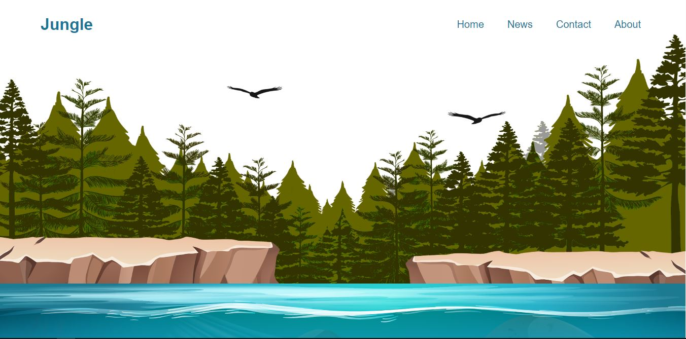
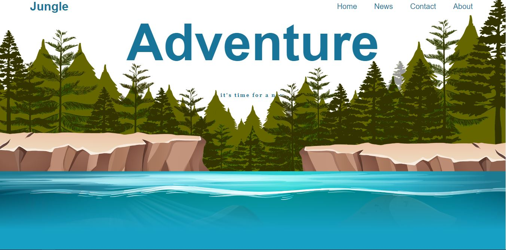

# Parallax Website - Front-end Project

Welcome to my parallax website project! This stunning website was built using HTML, CSS, and jQuery to create a captivating parallax scrolling experience.

## Features

- **Parallax Scrolling:** Enjoy a visually immersive experience as you scroll through captivating parallax effects that add depth and interactivity to the website.

- **Sleek and Modern Design:** The website's sleek and modern design ensures a polished and enjoyable user experience.

- **Responsive Layout:** The website is fully responsive, providing a seamless viewing experience on all devices, including large screens.

- **Interactive Sections:** Engage your audience with interactive elements powered by jQuery, creating a dynamic and memorable experience.

## Screenshots

### Large Screen View

## Live Demo

Experience the parallax website live by visiting [here](https://pathugit.github.io/parallex-website/#).

## Installation

To run the website locally, follow these steps:

1. Clone the repository: `git clone https://github.com/pathuGIT/parallex-website.git`
2. Navigate to the project directory: `cd parallax-website`
3. Open `index.html` in your preferred web browser.

## Feedback

I'm eager to hear your feedback and suggestions. If you encounter any issues or have questions, please open an issue on the GitHub repository.

## License

This project is licensed under the [MIT License](LICENSE).

